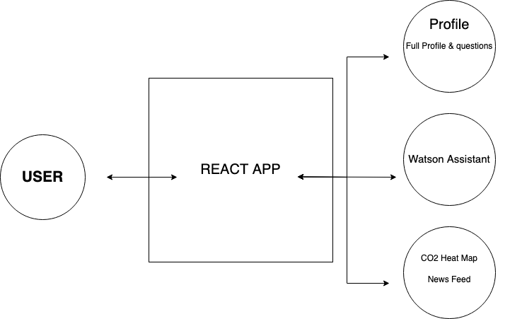

# PVD TEAM 3

# Scoop: Ride Share to Stop CO2 Pollution

## Project Summary

### The Issue We Are Hoping to Solve

Scoop addresses the pressing challenges of environmental sustainability and social isolation. It provides a platform for connecting individuals with shared interests and a common goal to reduce carbon emissions.

### How Our Technology Solution Can Help

Scoop leverages React and IBM Watson AI to create an innovative ride-sharing app that encourages eco-conscious choices and fosters social interactions. It offers a comprehensive solution for environmentally aware and adventure-seeking individuals.

### Our Idea

Scoop is not just another ride-sharing app; it's a transformative platform that unites people through shared interests and a commitment to reducing carbon emissions. By integrating React and IBM Watson AI, we've created a dynamic app that helps users connect and make eco-conscious choices while enjoying their journeys.

## Technology Implementation

### BRIEF DESCRIPTION OF THE ISSUE WE ARE TRYING TO SOLVE

Our app, now integrated with IBM Watson's chat bot, offers a personalized travel and event experience while taking a significant step towards reducing CO2 emissions. By facilitating carpooling and connecting users to shared events, we are actively promoting eco-friendly travel practices and a greener, more sustainable future. Join us in reducing your carbon footprint and creating a more environmentally conscious community of travelers.

### How our technology solution can help

Carpooling and eco-friendly choices reduce transportation CO2 emissions significantly.

### IBM AI service(s) used

IBM Watson Assistant was used in this project. It's graphically located on the homepage of our software. Programmatically, it is used as a component in our React app. The embedded HTML code is located in the client folder. If you open the "src" folder and click on "components," and then "ChatBot.js," you will see that the source is directed to the HTML file, and it's wrapped in an iframe tag. This is the solution we used to get our chatbot on our site. We used dialog, custom intents, as well as system-generated intents such as #General_greeting, #General_ending, and #General_about_you. In addition, we created entities for the bot to find locations and events the member is seeking out. We plan to expand the capabilities in V2 by opening up locations beyond the New England region, as well as implementing Watson Search to better serve members' very unique and individual needs. We aim to pair them with other members who have similar likes and interests derived from their responses to the questions located in the "view full profile" button in the user's profile section.

1. User access the site and is greeted by a welcome message and a widgit to access Watson.
2. The user searches for events they want to go to. The chat bot will ask where (city, state) so it can refine its search.
3. The bot "searches" the city or state in the New ENgland region that the user specified for the events requested and returns how many car pools it has found with people compatible to the member.
4. The bot sets up a car pool for the user with the best match.

### IBM AI Service(s) Used

- [Watson Assistant](https://cloud.ibm.com/catalog/services/watson-assistant) - Powers the chatbot feature for user interactions.

### Other IBM Technology Used

Our solution also incorporates other IBM technologies such as [IBM Cloud Object Storage](https://www.ibm.com/cloud/object-storage) for efficient data storage and retrieval.

### Solution Architecture

1. Users interact with Scoop through a user-friendly interface.
2. IBM Watson services, including Natural Language Understanding and Watson Assistant, process user requests, preferences, and event descriptions.
3. The app recommends events to users based on their preferences and location.
4. Ride-sharing and event information are presented to users.
5. Environmental impact calculations are performed in the background.

## Presentation Materials

### Solution Demo Video

### Project Development Roadmap

Our project currently offers a range of features:

- Event recommendations based on user preferences.
- Social integration through ride-sharing.
- Eco-conscious choices with carpooling.

In the future, we plan to expand Scoop with additional features and improvements based on user feedback. Here's our proposed roadmap:

## Additional Details

### How to Run the Project

To run the Scoop app locally for development and testing:

- Install Node.js
- Install Visual Studio Code
- Open your terminal and navigate to the 'client' folder.
- Enter `node -v` to verify your Node.js installation.
- Enter `npm install` to enable npm commands.
- Install required packages by running:
  - `npm install react-router-dom`
  - `npm install @fortawesome/react-fontawesome`
  - `npm install --save @fortawesome/fontawesome-svg-core`
  - `npm install --save @fortawesome/free-solid-svg-icons`
- Enter `npm start` in the terminal of the 'client' folder to run the app.

### Live Demo

You can access a live demo of the Scoop app at [example.com/scoop-demo](https://github.com/mspremulli/Scoop). Use the following credentials to log in:

- Username: abc
- Password: 123

---

_INSTRUCTIONS: You can remove the below section from your specific project README._

## About This Template

### Contributing

Please read [CONTRIBUTING.md](CONTRIBUTING.md) for details on our code of conduct, and the process for submitting pull requests to us.

### Versioning

We use [SemVer](http://semver.org/) for versioning. For the versions available, see the [tags on this repository](https://github.com/your/project/tags).

### Authors

- [Christian Alcantara](https://github.com/chrsalctra) - Initial work
- [Akinola Daramola](https://github.com/Nola360) - Initial work
- [Kenney Kong](https://github.com/KenneyKong) - Initial work
- [Stephen Kovolski](https://github.com/stephen-kovolski) - Initial work
- [Michael Spremulli](https://github.com/mspremulli) - Initial work

### License

This project is licensed under the Apache 2 License - see the [LICENSE](LICENSE) file for details.

### Acknowledgments

- Based on [Billie Thompson's README template](https://gist.github.com/PurpleBooth/109311bb0361f32d87a2).
